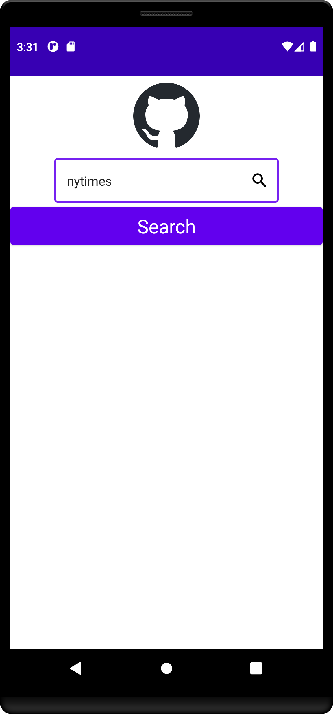
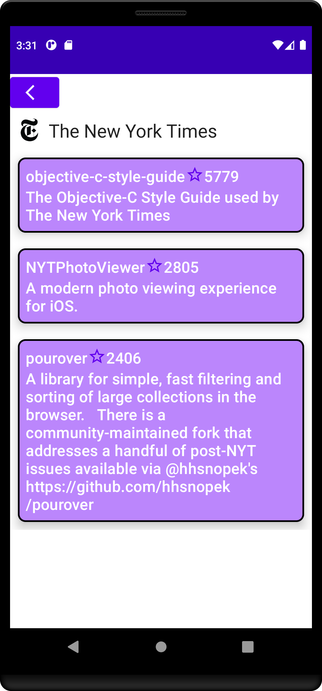
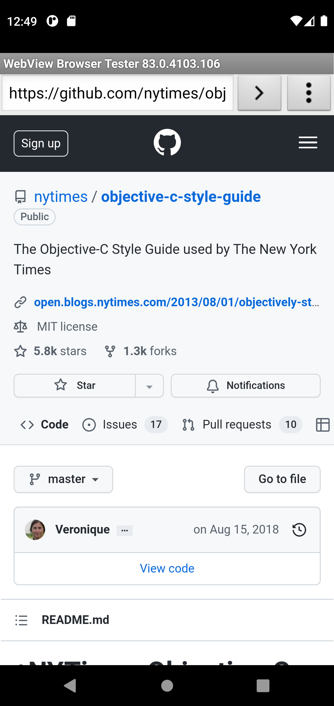

 

## Github repos search in Kotlin with MVVM and Jetpack Compose

> An Android application which allows a user to enter an organization name and then displays the top 3 most popular (by stars) repositories on GitHub for that organization. A user should be able to click on one of the Repos and navigate to it within a web view or chrome custom tabs.

Screens

1) Organization Search

This screen contains a single text field for inputting an organization name for search.
The screen has a single button labelled "Search" which searches for the organization on Github.
If the organization is not found onGithub, an error dialog appears.
If the organization is on Github, then the user is taken to the "Top 3 Organization Repos" screen.
The "Search" button is disabled when the input text field is empty.
Previous successfully searched Github organizations are saved and appear below the search field as a drop down for autocompletion.

2) Top 3 Organization Repos

The screen has a "Back" button at the top of the screen that will return the user to he "Organization Search" screen.
The selected Github Organization name and icon appear just below the "Back" button.
The top three repos are listed in card format.
Clicking a repo card takes the user to the "Repo in WebView" screen

3) Repo in WebView

The screen has a "Back" button at the top of the screen that will return the user to he "Organization Repos" screen.
The selected Github repos appears below the "Back" button in a WebView.

In this repo you'll find: 
* A single activity architecture using **[Jetpack Compose](https://developer.android.com/jetpack/compose)** and **[MutableState](https://developer.android.com/reference/androidx/lifecycle/LiveData)**. 
  The UI state is represented as plain classes that hold the UI state as per **[this](https://developer.android.com/topic/architecture/ui-layer/events#compose_2)** guidance from Google. 
* User Interface built with a **[ViewModel](https://developer.android.com/topic/libraries/architecture/viewmodel)** for each screen that displays state. 
* The user interface is built using **[Jetpack Compose Navigation](https://developer.android.com/jetpack/compose/navigation)**. 
* Search values are presented using a custom autocompletion widget where prior search values are saved using **[Datastore](https://developer.android.com/codelabs/android-proto-datastore#0)** . 
* Dependency injection using **[Hilt](https://developer.android.com/jetpack/androidx/releases/hilt)** . 
* Unit and UI tests using Jacoco for determining code coverage. 
* Espresso **[Automated accessibility tests](https://developer.android.com/training/testing/espresso/accessibility-checking)**. 
* Square's LeakCanary is implemented to detect memory leaks. 
* Internationalized string resources for English, French, and Spanish. 
* KTLint is included in the build path to enforce formatting standards. 

## Technical Documentation

This project includes a **[Technical Design Documents](app/src/TechnicalDesignDocuments)** folder documenting technical design decisions.

## Running the app

This app uses the https://api.github.com/ api endpoint to retrieve Github organizations and repos. While it has a lower rate limit than the endpoint at https://developer.github.com/v3/, it doesn't require an API key. So you should be able to run it out of the box with no prior configuration.

## Running tests

Type this command at the command line to run the unit tests suite.

./gradlew createDebugCoverageReport

Find the test results here: app/build/reports/androidTests/connected/index.html
Find the coverage report here: app/build/reports/coverage/androidTest/debug/index.html

or 

./gradlew createDebugUnitTestCoverageReport

Find the test results here: app/build/reports/tests/testDebugUnitTest/index.html
Find the coverage report here: app/build/reports/coverage/test/debug/index.html

## Screen Shots

<table>
<tr>

<td>

</td>

<td>

</td>

<td>

</td>

</tr>
</table>